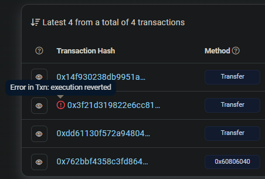
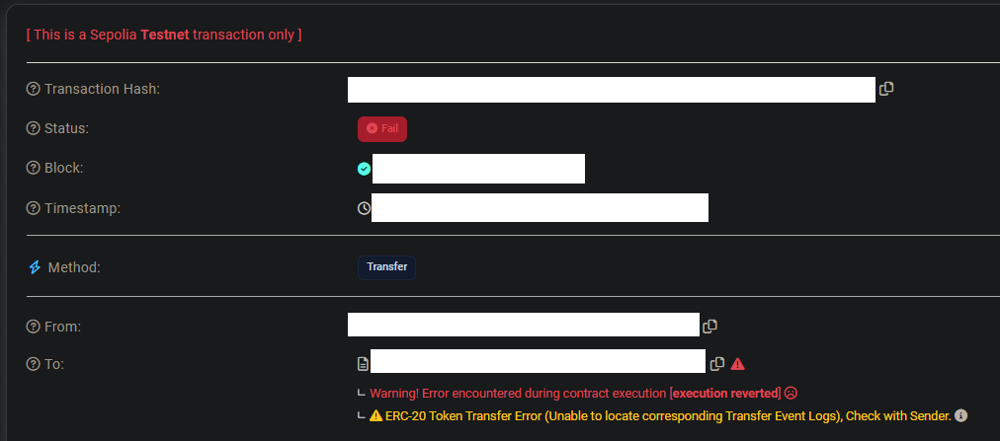
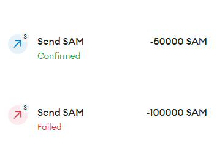

## Overview
- ERC-20 token that has different properties if it's the owner or non-owner that is trying to transfer it. Non-owner can only transfer 10% of their max token balance, but in that process it deducts 10x the specified send amount. This essentially forever locks/burns/traps 90% of all funds from token SAM that they receieve. 
- Tinkering was inspired by: https://github.com/Defi-Cartel/salmonella. Their idea was to bait sandwich bots into buying this trap token. I wanted to see if I could replicate a similar example with just the ERC-20 token side of things.

## Setup
- `npm init -y`
- `npx hardhat init`
- `npm install --save-dev hardhat`
- `npm install @nomicfoundation/hardhat-toolbox@^3.0.0`
- `npm install dotenv`
- `npx hardhat run scripts/deploy.js` deploys to hardhat instance
- `npx hardhat run scripts/deploy.js --network sepolia` deploys to sepolia (requires .env and hardhat.config.js setup with alchemy, sepolia and private key)

## Experimenting/Example
- Owner starts with 1,000,000 SAM tokens. The owner can interact with them as normal.
- Owner sends 500,000 SAM tokens to address B.
- address B can now only ever send up to 10% (50,000) of their 500,000 tokens. If they try to send 100,000 for example, the transfer fails.
- address B sends 50,000 to address C, which gets the 50,000 tokens, but address B gets deducted their whole 500,000 balance.
- This makes it so non-owners (every address that did not deploy the original contract) hold 10x less than they think they do, since they can only ever transfer out 10% at most.

